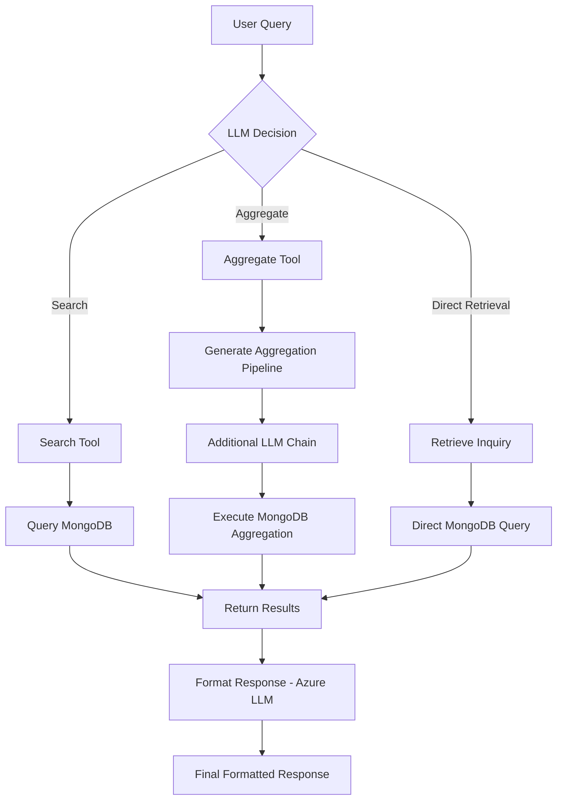

# Project Overview

This project is a native application utilizing Azure and function calling to retrieve data from a MongoDB database.

## File Structure

```
└── 📁src
    ├── 📁database
    │   ├── 📁__pycache__
    │   │   ├── mongodb_client.cpython-312.pyc
    │   │   └── mongodb_utils.cpython-312.pyc
    │   ├── mongodb_client.py
    │   └── mongodb_utils.py
    ├── 📁llms
    │   ├── 📁__pycache__
    │   │   └── azure_openai_client.cpython-312.pyc
    │   ├── azure_openai_client.py
    │   └── functions.json
    ├── 📁models
    │   └── purchase_order.py
    ├── 📁routes
    │   ├── 📁__pycache__
    │   │   └── purchase_order_routes.cpython-312.pyc
    │   ├── collection.json
    │   └── purchase_order_routes.py
    ├── 📁utils
    │   ├── 📁__pycache__
    │   │   ├── logger_utils.cpython-312.pyc
    │   │   ├── prompt.cpython-312.pyc
    │   │   ├── query_parser.cpython-312.pyc
    │   │   └── serialization.cpython-312.pyc
    │   ├── logger_utils.py
    │   ├── prompt.py
    │   ├── query_parser.py
    │   └── serialization.py
    └── main.py
```

This diagram illustrates the flow of the system:

1. User query is received and passed to the LLM for decision-making.
2. The LLM decides between three main paths: Search, Aggregate, or Direct Retrieval.
3. If Search is chosen, it uses the Search Tool to query MongoDB with specific fields.
4. If Aggregate is chosen, it generates an aggregation pipeline, which is then passed through another LLM chain to refine and execute the MongoDB aggregation.
5. If Direct Retrieval is chosen, it queries MongoDB directly without additional processing.
6. All paths converge to return results.
7. The results are then passed to an Azure LLM for formatting the response.
8. The formatted response is presented to the user.

Note: In the future, the Azure LLM used for formatting the response should be replaced with an offline model to enhance security and reduce dependency on external services.

## Setup Instructions

1. **Environment Configuration:**

   Copy the `example.env` file and update it with your Azure and MongoDB credentials:

   ```plaintext
   MONGO_URI=mongodb://<username>:<password>@localhost:27017

   # Name of the database to use
   DB_NAME=my_database
   COLLECTION_NAME=collection_name

   # Optional: Log file path and log level
   LOG_FILE=app.log
   LOG_LEVEL=INFO

   # AZURE
   AZURE_OPENAI_ENDPOINT="your_azure_endpoint"
   AZURE_OPENAI_API_KEY="your_api_key"
   AZURE_DEPLOYMENT_NAME="your_deployment_name"
   ```

2. **Install Dependencies:**

   Make sure to install the required dependencies by running:

   ```bash
   pip install -r requirements.txt
   ```

## Usage

Once the environment is set up and dependencies are installed, you can run the project using:

```bash
python src/main.py
```

This setup runs both a Flask API server and a Gradio UI client in parallel, allowing you to interact with the application via both interfaces.

### Access URLs

- **API Server** (Flask): [http://127.0.0.1:5000](http://127.0.0.1:5000)
- **UI Client** (Gradio): [http://127.0.0.1:7860](http://127.0.0.1:7860)


Ensure that your environment variables are correctly set up to connect to your MongoDB and Azure services.
